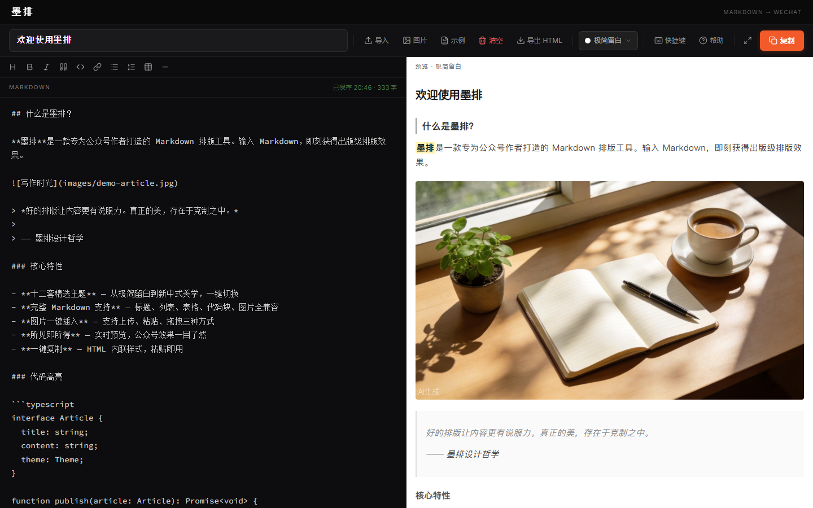

<div align="center">

# ✍️ 墨排 · Mopai

**免费在线 Markdown 转微信公众号排版工具**

输入 Markdown → 一键生成出版级公众号排版 → 复制即用，免注册打开即写。

<p align="center">
  <a href="https://health-525.github.io/wechat-article-formatter/">
    
  </a>
  <a href="https://github.com/Health-525/wechat-article-formatter">
    
  </a>
</p>

<p align="center">
  
  
  
  
  
</p>

> 关键词：Markdown 转公众号 / 公众号排版工具 / 微信编辑器 / 在线排版 / 文章排版美化 / 微信图文排版 / WeChat Markdown

</div>

---

## ✨ 一句话

**把 Markdown 变成可以直接粘贴进微信公众号编辑器的精美排版。** 21 套精选主题覆盖简约、文艺、国风、商务、潮流等风格，所有样式内联，粘贴即用。

---

## 🎯 适用场景

- **公众号推文** — 技术 / 产品 / 运营 / 设计长文一键排版
- **技术博客转载** — Markdown 博文转微信可读样式
- **产品文档 / 教程** — 代码块、表格、公式清晰呈现
- **课程讲义 / 企业周刊** — 多主题适配不同调性

---

## 📸 预览

<p align="center">
  <a href="https://health-525.github.io/wechat-article-formatter/">
    
  </a>
</p>
<p align="center"><sub>左：Markdown 编辑 + 工具栏　右：公众号排版实时预览</sub></p>

---

## 🧩 核心特性

**编辑器**
- 完整 Markdown：标题、段落、列表、表格、代码块、引用、图片、分隔线、链接
- 可视化工具栏 + 快捷键（`Ctrl/Cmd+B` 加粗、`+I` 斜体、`+Shift+C` 复制）
- LaTeX 公式：`$...$` 行内 / `$$...$$` 块级，基于 KaTeX
- 自动保存（浏览器本地）、全屏沉浸编辑、`.md/.markdown/.txt` 导入

**21 套主题**

| 简约 | 文艺 | 潮流 | 时尚 | 治愈 | 商务 | 国风 |
|:---:|:---:|:---:|:---:|:---:|:---:|:---:|
| 极简留白 | 新中式 | 潮流先锋 | 杂志画报 | 温暖治愈 | 商务蓝调 | 党政红金 |
| 灰调雅致 | 莫兰迪文艺 | 赛博霓虹 | 法式浪漫 | 清新自然 | — | — |
| — | 紫墨书签 | — | 橄榄手记 | 暖墨手记 | — | — |
| — | 摸鱼绿 · 摸鱼票据 | — | 极简石墨 · 禅意留白 · AI 笔记 | — | — | — |

**输出**
- 一键复制：生成带**内联样式**的 HTML，直接粘贴进公众号编辑器
- 导出 `.html` 文件存档
- 公众号兼容性实时校验：复制前提示 `data:`/`blob:` 图片等会导致粘贴丢失的问题

---

## 🚀 快速开始

### 在线使用（推荐）

👉 **<https://health-525.github.io/wechat-article-formatter/>**

1. 左侧输入或导入 Markdown
2. 顶部选择主题
3. 右上角「复制」
4. 粘贴到微信公众号编辑器，发布

### 本地开发

```bash
git clone https://github.com/Health-525/wechat-article-formatter.git
cd wechat-article-formatter
npm install
npm run dev      # http://localhost:3000
```

---

## 🛠 技术栈

- **[React 19](https://react.dev/)** · **[TypeScript](https://www.typescriptlang.org/)** · **[Vite 7](https://vitejs.dev/)**
- **[Tailwind CSS 3](https://tailwindcss.com/)** — 编辑器界面
- **[Marked](https://marked.js.org/)** — Markdown 解析
- **[KaTeX](https://katex.org/)** — 数学公式
- **[lucide-react](https://lucide.dev/)** — 图标

---

## 📁 项目结构

```
src/
  components/
    EditorWorkspace.tsx        # 主编辑器（编辑、预览、工具栏、主题、复制）
    ErrorBoundary.tsx
    workspace/                  # 工具栏 / 主题下拉 / 帮助 / 快捷键弹窗 / 分割条
  utils/
    markdownParser.ts          # Markdown → 公众号 HTML（内联样式 + 复制 + 校验）
    themes.ts                  # 经典 12 套主题（createTheme 构建器）
    gzhDesign/                 # gzh-design 9 套主题（renderer + 9 套组件库）
    mathRenderer.ts            # LaTeX 提取与注入
    mathSvgRenderer.ts          # gzh-design 数学公式 SVG 渲染
    katexCss.ts                 # KaTeX 样式（自动生成）
    taskRenderer.ts             # 任务清单渲染
  hooks/                       # useDebounce / useOnClickOutside
public/                         # favicon / og-image / 纸纹纹理 / robots / sitemap
```

---

## 📋 使用小贴士

- 💡 **图片要能复制进公众号**：请使用**公网可访问的 https 图片地址**。应用内上传/粘贴的图片会转为 `data:` 格式，公众号编辑器无法自动上传（粘贴后会丢失），复制时墨排会给出提醒。
- 💡 所有样式均为**内联样式**，`<section>` 结构、`<span leaf="">` 包裹，贴合公众号编辑器过滤规则。
- 💡 表格、引用、代码块均带主题化样式；数学公式用 `$...$` / `$$...$$`。
- 💡 复制到公众号后若公式样式异常，可改用「导出 HTML」。

---

## 🚀 部署

源码与部署都在 `main` 分支：推送到 `main` 会自动触发 GitHub Actions 构建（`npm run build`）并部署到 GitHub Pages。

> 一次性设置：仓库 Settings → Pages → Source 选择「GitHub Actions」。

```bash
git commit -m "feat: ..."
git push origin main      # 推送即自动部署
```

---

## 🤝 贡献

欢迎 Issue / PR：Fork → 基于 `main` 建特性分支 → 提 PR。

## 📄 许可证

[MIT](LICENSE) © 2025 墨排

---

<div align="center">

如果墨排帮到了你，欢迎 **⭐ Star** · **🍴 Fork** · **分享**，是对我们最大的支持。

</div>
